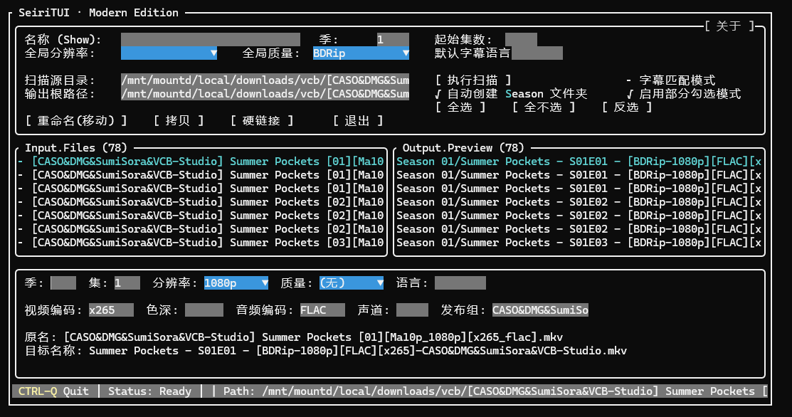
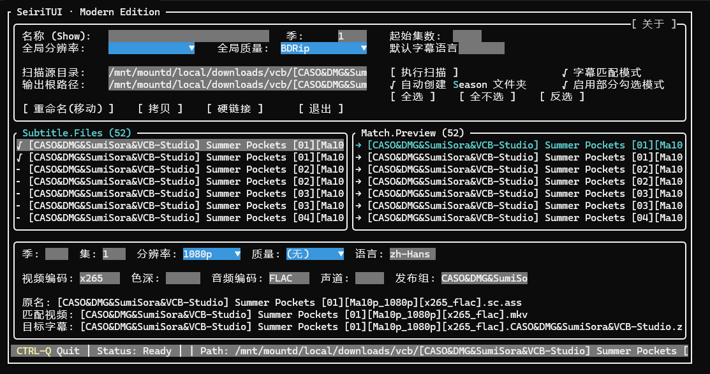

# Seiri-TUI (整理 · 现代化终端刮削辅助工具)

本程序是一个专为 BT/PT 玩家打造的本地番剧整理工具。它能够在终端环境下扫描指定（或当前）工作路径下的视频文件，通过智能解析原文件名，将其转化为符合 Emby/Jellyfin 官方推荐的命名格式（如 `Season 01/ShowName - S01E01.mkv`）。

为了配合 PT 保种需求，程序支持三种操作模式：直接重命名（移动）、文件复制、以及创建硬链接（Hardlink）。

## 📸 界面预览

<p align="center">
  
</p>
<p align="center">
  
</p>

## ✨ 核心特性

* **智能正则刮削**：自动使用正则表达式扫描当前目录，提取剧集名称、季数、集数、分辨率等信息。支持识别外挂字幕中的语言标签并转化为标准代码（如 `CHS` -> `zh-Hans`）。
* **多维度参数覆盖机制**：
  1. **独立参数**：针对单个文件的专属修改，优先级最高。
  2. **全局参数**：顶部的起始集、全局分辨率等，优先级次之。
  3. **正则提取参数**：从原文件名自动识别的数据，优先级最低。
* **PT 保种与数据安全**：
  * **Zero Corruption**：移动操作在跨盘时采用安全拷贝后删除的机制，确保原文件绝对不被损坏。
  * **跨盘硬链接阻断**：严格比对源与目标的底层挂载点，遇到跨盘硬链接直接拦截并报错，绝不降级为移动操作，完美保护 PT 做种状态。
* **高效直观的 TUI 交互**：基于 `Terminal.Gui` 构建现代化暗黑主题界面。提供左右 1:1 对称比对视图，即时预览重命名结果。

## 🚀 编译与运行

### 1. 环境要求
请确保已安装 [.NET SDK](https://dotnet.microsoft.com/download)。

### 2. 本地构建与运行
```bash
# 克隆仓库
git clone https://github.com/Gladtbam/Seiri-TUI.git
cd Seiri-TUI

# 直接运行
dotnet run --project SeiriTUI/SeiriTUI.csproj
```

# 3. GitHub Actions 自动构建

GitHub Actions 将自动构建并发布 deb 包。在 Release 页面下载即可。Linux 终端执行 `seiri-tui` 即可运行。

# 📖 使用指南

1. **扫描目录**：在顶部输入框中填入源目录和目标根目录，点击 [执行扫描]。
2. **全局微调**：在顶部控制区修改 名称 (Show) 或 起始集数，整个列表的目标预览将自动重算并更新。
3. **单体修正**：通过键盘（或鼠标）在列表中选中解析有误的文件。在底部 Item Details 区域修改其独立的季、集、分辨率或质量。
4. **执行转移**：确认右侧预览无误后，点击底部的 [硬链接] 或 [重命名(移动)] 执行。运行状态与异常（如权限不足、跨盘拦截）会实时投射在底部的红色状态栏中，单项错误不会导致程序崩溃。

# 🙏 致谢

本项目的发展离不开以下优秀的开源项目与工具：

* **[Terminal.Gui (gui.cs)](https://github.com/gui-cs/Terminal.Gui)**：为本项目提供了强大且跨平台的终端 UI 渲染引擎。
* **[CommunityToolkit.Mvvm](https://github.com/CommunityToolkit/dotnet)**：提供了简洁高效的 MVVM 架构基础支持。
* **[.NET](https://dotnet.microsoft.com/)**：微软提供的卓越跨平台开发框架与 Native AOT 编译支持。

此外，特别感谢 Google Gemini 在本项目的代码编写、重构、Bug 修复以及说明文档撰写过程中提供的智能辅助与技术支持。

# 📄 许可证

本项目采用 [**GNU General Public License v3.0 (GPL-3.0)**](LICENSE) 进行授权。  
每个人都有权复制、分发和修改该程序，但必须在相同协议下开源其衍生作品，且严禁将其并入专有软件。